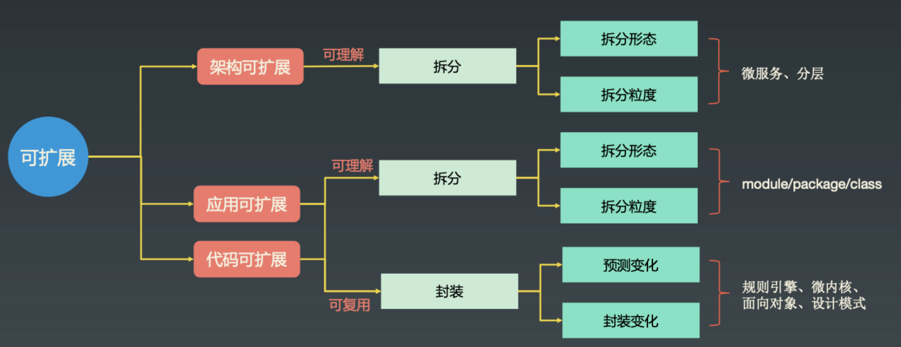

# 毕业总结

## 1. 课程收获

很高兴自己参加了这个训练营，有幸遇到华仔老师，通过30节深入浅出的课程，获得如下收获：

1. **收获高手视野，知道如何面对纷繁复杂的技术。**后端技术多且发展很快，在时间不充足、没有系统认知的情况下，只会感觉到自己不会的东西好多，想要学会一项技术很费时间，从而产生焦虑。有了华仔老师教授的知识体系（见下文 2.6 复杂度有哪些？各种复杂度的应对思路是什么？），很快能定位到要学习的技术，是在使用什么套路、解决什么问题，让自己能从本质上理解这项技术，不容易陷入细节，同时还能触类旁通，加速学会更多的技术。
2. **有了一套做架构设计的方法论，做架构设计更有信心。**以前是凭经验、凭感觉来做架构设计，没有具体的套路，容易卡壳，做起来耗费心力，且质量也不稳定；现在学了华仔老师的面向复杂度的架构设计方法论，有理论，有明确的步骤，有常见架构的套路，有拿来即用的文档模板，还有多个实战案例讲解，在这样的支持下，我有信心去面对更复杂和更多的架构设计工作。
3. **学到适合技术人的学习方法，让自己能更好的持续提升。**海绵学习法、Play学习法、Tech学习法、比较学习法、开源系统学习步骤等学习方法，使我知道如何更有效的学习，让自己持续提升。

## 2. 面向复杂度的架构设计方法论理解

### 2.1 什么是架构？（4R）

- 软件架构指系统的顶层结构，它定义了系统由哪些角色组成，角色之间的关系和运作规则。可以用4R的方式来理解。
- Rank 顶层结构
- Role 组成角色
- Relation 角色之间的关系
- Rule 运作规则

### 2.2 为什么要做架构设计？（降低复杂度）

- 软件系统规模增长，数据结构和算法不再是主要问题，整个系统的结构成为首要问题，需要通过架构设计来降低整个系统的复杂度

### 2.3 什么是面向复杂度的架构设计？（本质、思路、模式、套路）

- 本质：架构设计是为了降低软件系统的复杂度
- 思路(怎么做架构设计)：通过分析系统需求找到系统复杂的地方，然后设计方案
- 模式(有哪些复杂度)：复杂度来源：高性能、高可用、可扩展、安全、成本...
- 套路(怎么降低复杂度)：分库分表、缓存、集群、分片、微服务、DDD、异地多活...

### 2.4 如何开展面向复杂度的架构设计？（架构设计四阶段）

#### 2.4.1 架构设计前期

- 主要任务
  - 澄清不确定性
    - 明确利益干系人的诉求
    - 消除冲突的诉求
    - 诉求优先级排序
  - 识别复杂度
    - 识别核心场景
    - 明确或者预估质量需求
    - 识别复杂度（见下文 复杂度有哪些？各种复杂度的应对思路是什么？）

- 工作模式
  - 与业务方交流
  - 与利益干系人交流

- 关键输出
  - 总体业务架构图
  - 核心场景流程

#### 2.4.2 架构设计中期

- 主要任务
  - 设计备选方案
    - 头脑风暴
    - 筛选方案
    - 设计备选方案（见下文 架构设计模式）
  - 选择备选方案
    - 360度评估
    - 明确选择标准
    - 选择最终方案，并汇报

- 工作模式
  - 架构小组讨论
  - 架构小组写文档
  - 向利益干系人汇报

- 关键输出
  - 备选方案
  - 方案评估结论
  - 方案汇报结论

#### 2.4.3 架构设计后期

- 主要任务
  - 细化架构
    - 按照4R架构定义来细化架构
  - 完善架构
    - 可维护性、可测试性、可观测性、成本、安全

- 工作模式
  - 写架构设计文档（见 [架构实战营详细架构设计文档模板](https://xie.infoq.cn/article/a1c01e8f55c81b36a787f9f5b)）
  - 给技术团队宣讲架构

- 关键输出
  - 完整的架构设计方案

#### 2.4.4 架构设计验证阶段（贯穿项目全流程）

- 主要任务
  - 收集架构意见
    - 开发人员意见
    - 测试人员意见
    - 运维人员意见
  - 跟进架构落地效果
    - 性能测试结果
    - 压力测试结构
    - 线上运维情况

- 工作模式
  - 总结复盘
  - 收集吐槽

- 关键输出
  - 架构优化建议
  - 架构迭代计划

### 2.5 如何判断架构设计的好坏？（三原则）

- 合适原则：合适优于业界领先（制约：资源、时间、业务变化）
- 简单原则：简单优于复杂（越复杂越不可靠、越难扩展、越难处理故障）
- 演化原则：演化优于一步到位（满足当前业务，与业务一起发展）

### 2.6 复杂度有哪些？各种复杂度的应对思路是什么？

#### 2.6.1 架构设计复杂度模型

#### 2.6.2 架构设计复杂度应对之道

#### 2.6.3 可扩展复杂度模型

可扩展性：extensibility，指系统适应变化的能力，包含可理解和可复用两个部分

封装的技巧：规则引擎、微内核、抽象层、设计模式

#### 2.6.4 高性能复杂度模型

#### 2.6.5 高可用复杂度模型

#### 2.6.6 低成本复杂度本质

#### 2.6.7 安全性复杂度本质

#### 2.6.8 可测试性复杂度本质

可测试性：软件系统在测试环境下能否方便的支持测试各种场景的能力

#### 2.6.9 可维护性复杂度本质

可维护性：软件系统支持定位问题、修复问题的能力

#### 2.6.10 可观测性复杂度本质

可观测性：软件系统对外展现内部状态的能力

可观测性是可测试性、可维护性的基础

### 2.7 架构设计有哪些常用的模式？（三高一扩展的应对套路）

- 高并发架构模式
  - 异步
  - 缓存

- 高性能架构模式
  - 存储高性能
    - 读写分离
    - 分库分表
    - NoSQL
    - 缓存
  - 计算高性能
    - 单机高性能
      - PPC/preforked
      - TPC/prethreaded
      - Reactor
      - Proactor
    - 集群高性能
      - 负载均衡

- 高可用架构模式
  - 高可用理论支持
    - CAP理论
    - FMEA方法，排除架构可用性隐患的利器
  - 存储高可用
    - 双机
      - 主备复制/主从复制/主主复制
      - 主备切换/主从切换
    - 集群
      - 数据复制集群（例如Redis sentinel集群）
      - 数据分片集群（例如Redis cluster）
    - 数据分区
  - 计算高可用
    - 主备/主从
    - 对称集群（负载均衡集群）
    - 非对称集群（例如ZooKeeper集群）
  - 业务高可用
    - 接口级别高可用
      - 降级
      - 熔断
      - 限流
      - 排队
    - 地理级别高可用
      - 同城多机房
      - 跨城多机房
      - 跨国数据中心

- 可扩展架构模式
  - 分层
  - SOA
  - 微服务
  - 微内核

