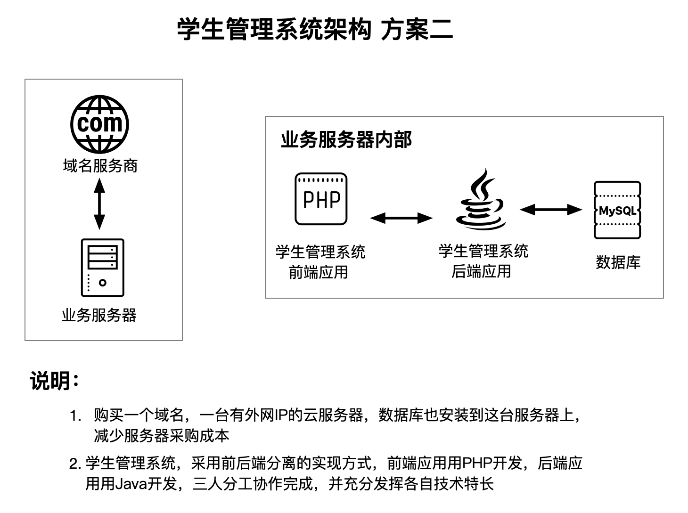

# 第一模块作业

## 1. 画出微信的业务架构图

见下图

社交需求 --> 信息发布获取需求 --> 便利办事需求

## 2. “学生管理系统”毕设架构设计

假设今年学校毕业设计要求提升，要求做真正可运行的学生管理系统，学院对毕设的具体要求如下: 

1. 要求可以通过公网域名访问;
2. 要求至少3人合作完成;
3. 能够支撑管理1000个学生; 
4. 答辩的时候会根据架构方案来进行打分，不推荐太简单和太复杂的方案

你找了2个好朋友一起来做这个项目，你们的基本情况如下: 

1. 大家都会Java，但是有一个是PHP高手 
2. 大家经济条件一般

作业要求: 
1. 对照面向复杂度架构设计方法论，构思2个以上的备选架构方案。 
2. 使用PPT来画出你的备选架构方案，并说明方案的优缺点。 
3. 给出你选择的最终方案以及选择理由。

见下图

**选择方案二，取舍的考虑如下：**

- 需求明确：毕业设计的要求是，能通过外网访问，没有要求高性能、高可靠
- 成本考虑：为了达到毕设的要求，购买一个域名和一台服务器即可
- 团队技术考虑：有团队成员擅长PHP，且PHP适合开发前端应用，所以采用前后端分离方式开发系统，充分发挥团队成员的技术优势
